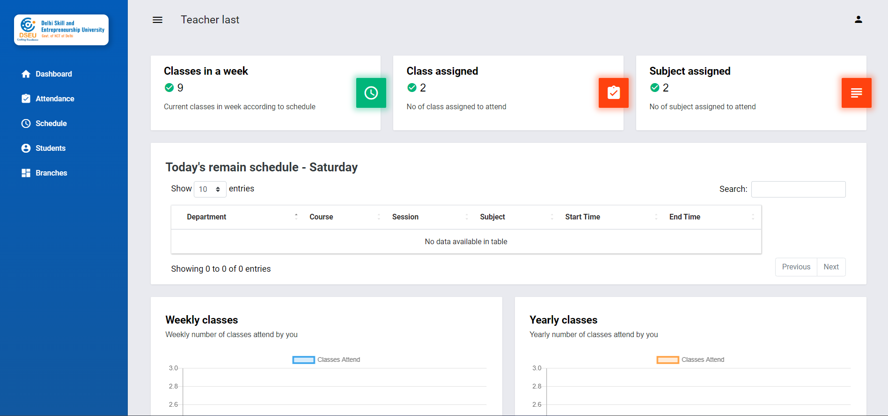

# College Management System 🏫

> **Note**
> The code is private. Please contact me on [WhatsApp](https://rkpassin132.github.io) if you require access to it.

## Contents

- [Introduction](#introduction)
- [Key Features](#key-features)
- [Admin Panel](#admin-panel)
- [Teacher Panel](#teacher-panel)
- [Student Panel](#student-panel)
- [Compatibility](#compatibility)
- [Code](#code)
- [Website images](#website-images)

## Introduction

The Attendance Management System is an online application designed to streamline the process of tracking student attendance and managing schedules. It offers various features that enhance efficiency for both teachers and students while promoting transparency in attendance records.

## Key Features

- **Time and Effort Saving:** The system eliminates the need for manual attendance taking, saving time and effort for teachers. With the ability to take live attendance, teachers can efficiently track student attendance during class sessions.

- **Transparency:** The system creates transparency between students and teachers by providing a clear record of attendance. Students can easily view their attendance status, reducing ambiguity and promoting accountability.

- **Data Export:** Attendance data can be downloaded as Excel or PDF files, allowing easy access and analysis of attendance records. This feature enables administrators and teachers to generate reports and perform data-driven analyses.

## Admin Panel

- **Overview:** Administrators can check the overall attendance status, including details of teachers, students, and attendance records.

- **Department and Course Management:** Administrators can create and manage departments, course types, and subjects. These components can be combined to create branches.

- **Attendance Type Configuration:** Administrators can define different attendance types such as Present, Absent, Leave, and more, to suit the specific requirements of the institution.

- **Teacher and Student Management:** Administrators can create and manage teacher profiles using either manual form submission or bulk upload. They can also assign schedules to teachers. Similarly, student profiles can be added individually or through file upload.

- **Branch and Session Management:** Administrators can add and manage student branches and promote students to different sessions or semesters.

- **Student Profile and Analysis:** Administrators have access to student profiles, including personal details, timetable, and attendance analysis. They can perform account management tasks like password changes, account deactivation, or deletion.

## Teacher Panel

- **Class and Schedule Overview:** Teachers can view their class schedules and relevant details.

- **Live Attendance:** Teachers can take attendance during class sessions, ensuring accurate tracking of student presence.

## Student Panel

- **Class and Schedule Overview:** Students can view their class schedules and related information.

## Compatibility:

| Device  |    Supported |
| :------ | -----------: |
| Android | Yes or Higer |
| Windows |          Yes |
| Mac     |          Yes |
| Linux   |          Yes |

### Code

| Framework             | Usage    |
| :-------------------- | :------- |
| Core PHP              | Backend  |
| SQL                   | Database |
| HTML, CSS, JS, Jquery | Frontend |
| Ajax                  | API call |

### Website images [(more image)](images/)

| Features                                                                                                            |
| :------------------------------------------------------------------------------------------------------------------ |
| Admin Panel                                                                                                         |
|    |
| Teacher Panel                                                                                                       |
|  |
| Student Panel                                                                                                       |
|  |
